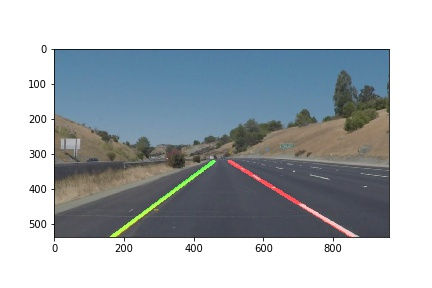

# **Finding Lane Lines on the Road** 

### 1. Describe your pipeline. As part of the description, explain how you modified the draw_lines() function.

I follow the approach taught in the lesson closely. My pipeline (_imagePipeline_) has the following steps.
* convert the images to grayscale (_grayscale_).
* apply Gaussian smoothing to the images (_gaussian_blur_).
* use Canny algorithm to detect edges in smoothed grayscale images (_canny_).
* define the region of interest, a trapezoid centered in the bottom half of the image (_region_of_interest_). 
* find line segments with Hough Transform on Canny edges (_houghLinesFit_).
* separate line segments from their slopes and positions into right and left groups. A single line segment will add two points to the designated group (_houghLinesFit_).
* fit a straight line to the points in left and right groups separately (_houghLinesFit_).
* overlay the right and left lane lines to the original image (_weighted_img_).

I use the same parameters of Canny and Hough Transform that were used in the quiz (15: Hough Transform).  Those parameters are suitable for  all the images and videos of this project except for the challenge video.  The results are shown in [test_images_output](./test_images_output) and [test_videos_output](./test_videos_output) folders and [P1.ipynb](./P1.ipynb) is the code.

  _houghLinesFit_ is the new function that I wrote. It finds lines on Canny edges (_cv2.HoughLinesP_), separates line segments into two groups of points, and fit a linear model to the points (_linearRegression_). The output is an image with left and right lane lines plotted.

### 2. Identify potential shortcomings with your current pipeline

The pipeline doesn’t work well on the challenge video. It has shadows and the color of the road is not uniform (new/faded Asphalt paving). The left lane is sometimes very faint .The region of interest need to be adjusted because the bottom the view is blocked (not sure what it is) and the road is more curved.

### 3. Suggest possible improvements to your pipeline

I use two trapezoids to cover left and right lanes to reduce the unwanted edge detection in the middle of the road caused by shadows and road color changes.  I lower the threshold in Canny to detect faint yellow left lane.  Spurious horizontal stripes are not included in the regression (the slope needs to be >0.5 or <-0.5). The resulting video is [challenge.mp4](./test_videos_output/challenge.mp4).
The detection is not perfect.  The lane direction sometimes changes a little bit. It’s tricky to detect lane marks when the surrounding has similar line features.

